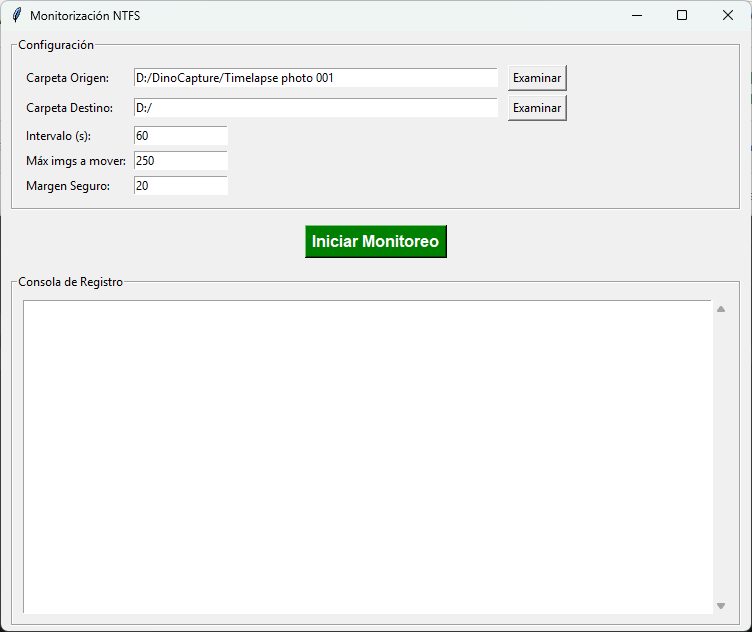

# Monitorización NTFS — Move Files

Descripción
- Este proyecto es una utilidad ligera en Python para monitorizar una carpeta de origen en un sistema Windows y mover imágenes a una carpeta destino automáticamente.
- La interfaz principal es una pequeña aplicación con campos de configuración (carpeta origen, carpeta destino, intervalo, máximo de imágenes a mover y margen de seguridad) y una consola de registro donde se muestran eventos y errores.

Objetivo
- Evitar que la captura timelapse llene en exceso la única carpeta de origen, moviendo periódicamente las imágenes capturadas a un directorio de destino.
- Permitir operación automática y continua, con registro visible para facilitar el diagnóstico.

Funcionamiento resumido
- La aplicación revisa la carpeta origen cada `intervalo` segundos.
- Si encuentra imágenes nuevas y el número a mover no supera `Imágenes a mover` (considerando `Margen Seguro`), las mueve al destino.
- Los eventos (inicio, errores, archivos movidos) se muestran en la consola de registro.

Configuración y uso
- Rellena los campos de configuración en la interfaz gráfica:
  - **Carpeta Origen**: carpeta donde la cámara deja las fotos.
  - **Carpeta Destino**: carpeta a donde se moverán las fotos.
  - **Intervalo (s)**: frecuencia de comprobación en segundos.
  - **Imágenes a mover**: límite por ciclo de ejecución.
  - **Margen Seguro**: número de archivos que se deben mantener en origen por seguridad.
- Pulsa el botón verde **Iniciar Monitoreo** para comenzar.

Imagen de la aplicación
- La captura de pantalla de la interfaz está ubicada en `img/app-screenshot.png` y mostrada aquí para referencia:



Archivos del repositorio:
- [move_files.py](move_files.py) : script principal con la lógica de monitorización y movimiento de archivos.
- [move_files.exe](dist/move_files.exe): archivo ejecutable para Windows.

Compilar para Windows (PyInstaller):
```bash
pyinstaller --onefile --noconsole move_files.py
```

Autor
David Sosa-Trejo.
